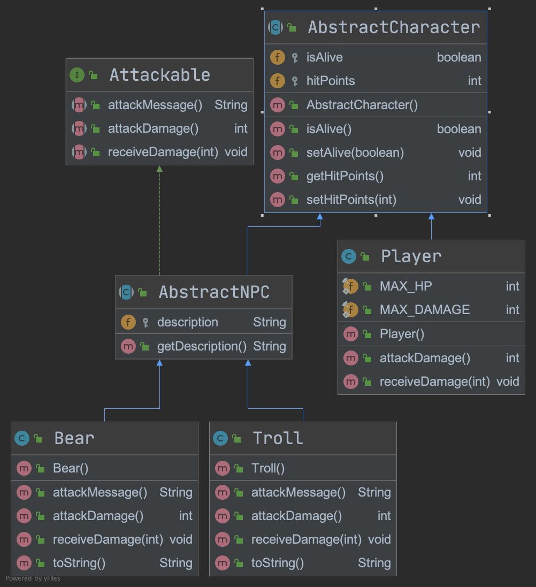

# Text Adventure Game
This text game reviews the following basic Java concepts:

* IDE Basics
* Maven Basics
* Java Language Fundamentals
* Conditionals
* Loops
* Branching
* Constructors
* Encapsulation
* Inheritance
* Exceptions
* Collections
* Strings
* I/O Streams
* Lambdas
* Stream API

The following is the map that is used to generate the game world.


## Phase 1 - Models
In this phase, we'll start out by creating the model classes used to
  represent entities in the game.  Entities include objects for exits and game
  locations.
 
Create the following model classes:

* Direction
* Copyable
* Exit
* Location

###### Direction
This enum demonstrates:
* enums in Java
* Constructors in enums
* Fields in enums

The **Direction** class represents physical directions you can travel on the 
 game map.  It uses an abbreviation field to represent short-cut keys that map
 to specific directions.
```java
package com.example.game.model;

public enum Direction {

    UNDEFINED("NULL"),
    NORTH("N"),
    SOUTH("S"),
    EAST("E"),
    WEST("W"),
    UP("U"),
    DOWN("D"),
    NORTHEAST("NE"),
    NORTHWEST("NW"),
    SOUTHEAST("SE"),
    SOUTHWEST("SW"),
    IN("I"),
    OUT("O");

    private final String abbreviation;

    Direction(String abbreviation) {
        this.abbreviation = abbreviation;
    }

    public String getAbbreviation() {
        return this.abbreviation;
    }
}
```

###### Copyable
This interface demonstrates:
* Generic classes
* Using generic parameterization in methods

The **Copyable** interface defines a generic method that needs to be implemented 
when a given class needs to be able to have a deep copy made.  The 
implementation usually relies on a copy constructor within the class that 
implements this generic interface.
```java
package com.example.game.model;

public interface Copyable<T> {

    T copyOf(T t);
}
```
###### Exit
This class demonstrates:
* Encapsulation
* Fields
* Constructors
* Copy constructors
* Getters
* Interface method implementation
* toString method

The **Exit** class represents an exit in the game.  It is associated with one 
and only one location in the game.
```java
package com.example.game.model;

public class Exit implements Copyable<Exit> {

    private final String id;
    private final Direction direction;
    private final Location leadsTo;

    private Exit(Exit other) {

        this.id = other.id;
        this.leadsTo = other.leadsTo;
        this.direction = other.direction;
    }

    public Exit(String id, Direction direction, Location leadsTo) {

        this.id = id;
        this.direction = direction;
        this.leadsTo = leadsTo;
    }

    public String getId() {
        return id;
    }

    public String getDirectionName() {

        return this.direction.name();
    }

    public String getShortDirectionName() {

        return this.direction.getAbbreviation();
    }

    public Location getLeadsTo() {

        return this.leadsTo;
    }

    @Override
    public Exit copyOf(Exit exit) {

        return new Exit(exit);
    }

    public String toString() {

        return this.direction.name();
    }
}
```
###### Location
This class demonstrates:
* Encapsulation
* Fields
* Collections (Lists)
* AtomicInteger class
* Lambda
* Constructors
* Getters
* Mutators
* toString method
* Utility (static) class usage

The **Location** class represents a location (room, mountain top, etc...) in 
game.  It can have one or more exits as well as characters.
```java
package com.example.game.model;

import com.example.game.model.character.AbstractNPC;
import com.example.game.util.CollectionUtility;

import java.util.ArrayList;
import java.util.List;
import java.util.concurrent.atomic.AtomicInteger;

public class Location {

    private final String id;
    private final String roomTitle;
    private final String roomDescription;
    private final List<Exit> exits;
    private final List<AbstractNPC> characters;

    public Location(String id, String title, String description) {

        this.id = id;
        this.roomTitle = title;
        this.roomDescription = description;
        this.exits = new ArrayList<>();
        this.characters = new ArrayList<>();
    }

    public void addExit(Exit exit) {
        this.exits.add(exit);
    }

    public void addCharacter(AbstractNPC npc) {
        characters.add(npc);
    }

    public String getId() {
        return this.id;
    }

    public List<Exit> getExits() {
        return CollectionUtility.cloneList(this.exits);
    }

    public String getTitle() {
        return this.roomTitle;
    }

    public String getDescription() {
        return this.roomDescription;
    }

    public List<AbstractNPC> getCharacters() {
        return characters;
    }

    public int getActiveCharacterCount() {
        AtomicInteger counter = new AtomicInteger(0);
        characters.forEach(npc -> {
            if (npc.isAlive()) {
                counter.incrementAndGet();
            }
        });
        return counter.get();
    }

    public boolean hasCharacters() {
        return this.characters.size() > 0;
    }

    public String toString() {
        return this.roomTitle;
    }
}
```

## Phase 2 - Utility Classes
Utility classes are created when you have multiple classes that need to access 
the same functionality, or if you want to provide static functionality to some 
other class.  They are not instantiated, but may contain static class variables, 
if needed.

###### CollectionUtility
This class demonstrates:
* Static methods
* Generic methods
* Private constructors
* Collections (List)

The **CollecitonUtility** class manipulates 
**Collection** types of data.  So far, we only need to be able to clone a 
**Copyable** list of elements into another list.  It's used for making deep 
copies of list elements.
```java
package com.example.game.util;

import com.example.game.model.Copyable;

import java.util.List;
import java.util.stream.Collectors;

public class CollectionUtility {

    private CollectionUtility() {
        // this is private to block instantiation
    }

    public static <T extends Copyable<T>> List<T> cloneList(List<T> list) {
        return list.stream()
                .map(e -> e.copyOf(e))
                .collect(Collectors.toList());
    }
}
```
###### GameInitializer
This class demonstrates:
* Static methods
* Workflow implementation
* Loggers

The **GameInitializer** class creates the game environment.  It 
instantiates all the locations, exits, npc and player characters used in the 
game and makes all the associations needed between each object.
```java
package com.example.game.util;

import com.example.game.GameWorld;
import com.example.game.model.Direction;
import com.example.game.model.Exit;
import com.example.game.model.Location;
import com.example.game.model.character.Bear;
import com.example.game.model.character.Troll;
import org.slf4j.Logger;
import org.slf4j.LoggerFactory;

public final class GameInitializer {

    private static final Logger logger = LoggerFactory.getLogger(GameInitializer.class.getSimpleName());

    private GameInitializer() {
    }

    public static GameWorld initializeGame() {

        GameWorld game = new GameWorld();

        // Create room objects
        Location location1 = new Location("1", "Bottom of the Well", "You have reached the bottom of a deep and rather smelly well. Less than a foot of water remains, and it looks undrinkable.");
        Location location2 = new Location("2", "Courtyard", "At the centre of the courtyard is an old stone well. A strong and sturdy rope is attached to the well, and descends into the darkness. The only other items of interest are the farmhouse to the north, and a path to the east.");
        Location location3 = new Location("3", "Farmhouse Entrance", "The door to the farmhouse hangs crooked, and is slightly ajar. Obviously no-one has lived here for some time, and you can only guess at what lies within.");
        Location location4 = new Location("4", "Blood-Stained Room", "Dried blood stains can be seen on the walls and stone floor of the farmhouse. Whatever massacre occurred here long ago, you can only guess. With the absence of bodies, however, you may never know.");
        Location location5 = new Location("5", "Long Windy Path", "You are standing on a long, windy path, leading from the mountains in the far east, to a small farm that lies to the west.");
        Location location6 = new Location("6", "Base of the Mountain", "At the base of the mountain is a path that leads westward beyond a large boulder. Climbing such a mountain would be difficult - if not impossible.");
        Location location7 = new Location("7", "Top of the Mountain", "From this vantage point, you can see all that lies on the plains below. Large boulders dot the landscape, and just within view to the west you make out some sort of a building - though its details are too hard to make out from this distance.");
        Location location8 = new Location("8", "Outside Castle", "You are standing outside a rather large and obviously abandoned castle.  The drawbridge is up, but a cracked and broken door lays open headed downward into the castle dungeon.");
        Location location9 = new Location("9", "Castle Dungeon", "You enter a dimly lit room.  Along two of the walls, several skeletons lay slumped over and several more are chained to the wall.  It's apparent from the tracks on the ground that some kind of large animal has been here, but is now long gone.");

        // Create exit objects
        Exit exit1 = new Exit("1", Direction.UP, location2);
        Exit exit2 = new Exit("2", Direction.DOWN, location1);
        Exit exit3 = new Exit("3", Direction.NORTH, location3);
        Exit exit4 = new Exit("4", Direction.SOUTH, location2);
        Exit exit5 = new Exit("5", Direction.NORTH, location4);
        Exit exit6 = new Exit("6", Direction.SOUTH, location3);
        Exit exit7 = new Exit("7", Direction.EAST, location5);
        Exit exit8 = new Exit("8", Direction.WEST, location2);
        Exit exit9 = new Exit("9", Direction.EAST, location6);
        Exit exit10 = new Exit("10", Direction.WEST, location5);
        Exit exit11 = new Exit("11", Direction.UP, location7);
        Exit exit12 = new Exit("12", Direction.DOWN, location6);
        Exit exit13 = new Exit("13", Direction.WEST, location8);
        Exit exit14 = new Exit("14", Direction.EAST, location7);
        Exit exit15 = new Exit("15", Direction.DOWN, location9);
        Exit exit16 = new Exit("16", Direction.UP, location8);

        // associate exits with locations
        location1.addExit(exit1);
        location2.addExit(exit2);
        location2.addExit(exit3);
        location2.addExit(exit7);
        location3.addExit(exit4);
        location3.addExit(exit5);
        location4.addExit(exit6);
        location5.addExit(exit8);
        location5.addExit(exit9);
        location6.addExit(exit10);
        location6.addExit(exit11);
        location7.addExit(exit12);
        location7.addExit(exit13);
        location8.addExit(exit14);
        location8.addExit(exit15);
        location9.addExit(exit16);

        // create npc characters
        Bear bear = new Bear();
        Troll troll = new Troll();

        // add npc characters
        location6.addCharacter(bear);
        location8.addCharacter(troll);

        // set initial location
        game.setCurrentLocation(location2);

        logger.info("Game initialized.");
        return game;
    }
}
```
###### GameOutputStream
This class demonstrates:
* Fields
* PrintStream
* StringTokenizer
* While-loop
* if-statements

The **GameOutputStream** class formats the text output into a fixed 
width output.
```java
package com.example.game.util;

import java.io.OutputStream;
import java.io.PrintStream;
import java.util.StringTokenizer;

public class GameOutputStream {

    private final PrintStream out;
    private final int width;

    public GameOutputStream(OutputStream out, int width) {
        this.out = new PrintStream(out);
        this.width = width;
    }

    public void print(String str) {

        int currentWidth = 0;
        StringTokenizer tokenizer = new StringTokenizer(str);

        while (tokenizer.hasMoreTokens()) {

            String token = tokenizer.nextToken();

            if (currentWidth + token.length() >= width) {
                out.println();
                currentWidth = 0;
            }

            out.print(token + " ");
            currentWidth += token.length() + 1;
        }
        out.flush();
    }

    public void println(String str) {
        print(str);
        out.println();
    }

    public void println() {
        out.println();
    }
}
```

## Phase 3 - Game Classes
These classes are responsible for the game flow as well as representing the game
environment.
###### GameWorld
This class demonstrates:
* Fields
* Mutators
* Collections
* Lambdas

The **GameWorld** class represents the game world.  It contains references to
the **Player** as well as the **GameOutputStream** and current location.  The
**GameWorld** class can be though of as the current node of a graph.  The other
locations are kept-track-of through the linking of the location nodes through
the exit nodes.
```java
package com.example.game;

import com.example.game.model.Exit;
import com.example.game.model.Location;
import com.example.game.model.character.AbstractNPC;
import com.example.game.model.character.Player;
import com.example.game.util.GameOutputStream;

import java.io.OutputStream;
import java.util.List;

public class GameWorld {

    private final Player player;
    private Location currentLocation;
    private GameOutputStream gameOutputStream;

    public GameWorld() {

        this.currentLocation = null;
        this.player = new Player();
        setOutputStream(System.out, 80);
    }

    public Player getPlayer() {

        return player;
    }

    public Location getCurrentLocation() {

        return this.currentLocation;
    }

    public void setCurrentLocation(Location newLocation) {

        this.currentLocation = newLocation;
    }

    public void setOutputStream(OutputStream out, int width) {

        this.gameOutputStream = new GameOutputStream(out, width);
    }

    public void showLocation() {

        this.gameOutputStream.println(currentLocation.getTitle());
        this.gameOutputStream.println(currentLocation.getDescription());
        this.gameOutputStream.println();
    }

    public void showCharacters() {

        List<AbstractNPC> characters = this.currentLocation.getCharacters();
        characters.forEach(npc -> this.gameOutputStream.println(npc.toString()));
        this.gameOutputStream.println();
    }

    public void showExits() {

        this.gameOutputStream.println("There are exits available... ");
        for (Exit exit : this.currentLocation.getExits()) {
            this.gameOutputStream.println(exit.toString());
        }
    }

    public void showHpAll() {

        showHpPlayer();
        if (this.currentLocation.getCharacters().isEmpty()) {
            showHpCharacter();
        }
        println();
    }

    public void showHpPlayer() {

        println("The " +
                Player.class.getSimpleName() +
                " has " +
                this.player.getHitPoints() +
                " HP");
    }

    public void showHpCharacter() {

        List<AbstractNPC> characters = this.currentLocation.getCharacters();
        characters.forEach(npc -> println("The " +
                npc.getClass().getSimpleName().toLowerCase() +
                " has " +
                npc.getHitPoints() +
                " HP")
        );
    }

    public void println() {

        this.gameOutputStream.println();
    }

    public void println(String str) {

        this.gameOutputStream.println(str);
    }
}
```

###### TextAdventureGame
This class demonstrates:
* Fields
* PrintStream
* StringTokenizer
* While-loop
* if-statements
* try-catch
* Lambdas
* Streams
* Game loops

**TextAdventureGame** is the main entry point into the game.  It contains the
 main flow of logic of the game.
 
```java
package com.example.game;

import com.example.game.model.Action;
import com.example.game.model.Direction;
import com.example.game.model.Exit;
import com.example.game.model.character.AbstractNPC;
import com.example.game.model.character.Player;
import com.example.game.util.GameInitializer;
import org.slf4j.Logger;
import org.slf4j.LoggerFactory;

import java.util.Arrays;
import java.util.List;
import java.util.Scanner;
import java.util.concurrent.atomic.AtomicBoolean;

class TextAdventureGame {

    private static final Logger logger = LoggerFactory.getLogger(TextAdventureGame.class.getName());
    private final GameWorld game;

    public TextAdventureGame() {

        game = GameInitializer.initializeGame();
        game.setOutputStream(System.out, 60);
    }

    public static void main(String[] args) {

        try {
            new TextAdventureGame().play();
        } catch (Exception e) {
            logger.error("There was an error.", e);
        }
    }

    private void play() {

        String command;
        AtomicBoolean validCommand = new AtomicBoolean(false);
        Scanner scanner = new Scanner(System.in);

        boolean running = true;
        while (running) {

            // show location
            game.showLocation();

            // show characters
            if (game.getCurrentLocation().hasCharacters()) {
                game.showCharacters();
            }

            // show exits
            game.showExits();

            // Get user input
            command = scanner.nextLine();
            this.game.println();

            // Parse user input
            if (command.length() == 0) {
                this.game.println("Huh? Invalid command!");
                continue;
            }

            // Identify command type
            command = command.toUpperCase().trim();
            String finalCommand = command;

            boolean isAction = Arrays.stream(Action.values())
                    .anyMatch(action -> action.name().equals(finalCommand) ||
                            action.getAbbreviation().equals(finalCommand));
            boolean isDirection = Arrays.stream(Direction.values())
                    .anyMatch(direction -> direction.name().equals(finalCommand) ||
                            direction.getAbbreviation().equals(finalCommand));
            boolean isQuit = doQuit(command);

            // process move
            if (isDirection) {
                boolean success = doMove(command);
                validCommand.set(success);
                game.getPlayer().setHitPoints(Player.MAX_HP);
            } else if (isAction) {
                boolean success = doAttack(command);
                validCommand.set(success);
            } else if (isQuit) {
                validCommand.set(true);
                running = false;
            }

            // If no valid commands, warn the user...
            if (!validCommand.get()) {
                this.game.println("Huh? Invalid command!");
                this.game.println();
            }

            // player is dead
            if (!game.getPlayer().isAlive()) {
                this.game.println("YOU HAVE DIED!!");
                this.game.println("You fall to the ground where your bones are eventually gnawed on by a large fuzzy animal.");
                running = false;
            }
        }
    }

    // Attack logic...
    private boolean doAttack(String command) {

        boolean validCommand = false;
        Player player = game.getPlayer();
        int activeNPCCount = game.getCurrentLocation().getActiveCharacterCount();

        if (activeNPCCount > 0) {
            AbstractNPC npc = game.getCurrentLocation().getCharacters().get(0);
            if (command.equals(Action.KILL.getAbbreviation()) ||
                    command.equals(Action.ATTACK.getAbbreviation()) ||
                    command.equals(Action.KILL.name()) ||
                    command.equals(Action.ATTACK.name())) {

                // player attacks...
                int playerDamage = player.attackDamage();
                npc.receiveDamage(playerDamage);
                game.println("The " +
                        npc.getClass().getSimpleName().toLowerCase() +
                        " receives " +
                        playerDamage +
                        " hp damage.");

                // if npc is dead...
                if (npc.getHitPoints() <= 0) {

                    npc.setAlive(false);
                    npc.setHitPoints(0);
                    game.println("The " +
                            npc.getClass().getSimpleName().toLowerCase() +
                            " is dead!");

                } else { // player gets hit...

                    int npcDamage = npc.attackDamage();
                    player.receiveDamage(npcDamage);
                    game.println(npc.attackMessage());
                    game.println("You receive " + npcDamage + " hp damage.");

                    if (player.getHitPoints() >= 0) {
                        game.println("You survive the hit!");
                    } else {
                        player.setHitPoints(0);
                        player.setAlive(false);
                    }
                }

                game.showHpAll();
                validCommand = true;
            }
        }
        return validCommand;
    }

    // movement logic...
    private boolean doMove(String command) {

        boolean validCommand = false;
        List<Exit> exits = game.getCurrentLocation().getExits();
        for (Exit exit : exits) {
            if (exit.getDirectionName().equals(command) ||
                    exit.getShortDirectionName().equals(command)) {

                game.setCurrentLocation(exit.getLeadsTo());
                validCommand = true;

                break;
            }
        }
        return validCommand;
    }

    // when the player wants to quit...
    private boolean doQuit(String command) {

        boolean quit = false;
        if (command.equalsIgnoreCase("QUIT")) {
            this.game.println("Okay. Bye!");
            quit = true;
        }
        return quit;
    }
}
```
## Phase 4 - Adding NPCs
In this phase, we'll add code that enables the use of NPCs (Non-Player
 Characters)  as well as a player character.  Characters are implemented
 using the following UML diagram.



###### AbstractCharacter

**AbstractCharacter** represents a basic character entity in the game.  All
 characters are child classes of this class.

```java
package com.example.game.model.character;

public abstract class AbstractCharacter {

    protected boolean isAlive;
    protected int hitPoints;

    public AbstractCharacter() {
        isAlive = true;
    }

    public boolean isAlive() {
        return isAlive;
    }

    public void setAlive(boolean alive) {
        isAlive = alive;
    }

    public int getHitPoints() {
        return hitPoints;
    }

    public void setHitPoints(int hitPoints) {
        this.hitPoints = hitPoints;
    }
}
```

###### Atackable

**Atackable** classes are those that may be attacked by the player.

```java
package com.example.game.model.character;

public interface Attackable {

    String attackMessage();

    int attackDamage();

    void receiveDamage(int damage);
}
```

###### AbstractNPC

**AbstractNPC** represents an attackable class in the game.  All NPCs are
 child classes of this class.
 
```java
package com.example.game.model.character;

public abstract class AbstractNPC extends AbstractCharacter implements Attackable {

    protected String description;

    public String getDescription() {
        return description;
    }
}
```

###### Player

The **Player** class represents the player in the game. 

```java
package com.example.game.model.character;

import java.util.Random;

public class Player extends AbstractCharacter {

    public static final int MAX_HP = 50;
    public static final int MAX_DAMAGE = 25;

    public Player() {
        this.hitPoints = MAX_HP;
    }

    public int attackDamage() {
        return new Random().nextInt(MAX_DAMAGE + 1);
    }

    public void receiveDamage(int damage) {
        this.hitPoints -= damage;
    }
}
```

###### Bear

A **Bear** is a specific type of AbstractNPC.

```java
package com.example.game.model.character;

import java.util.Random;

public class Bear extends AbstractNPC {

    public Bear() {
        this.description = "There is a large menacing bear here!";
        this.hitPoints = 50;
    }

    @Override
    public String attackMessage() {
        return "The bear swipes his massive paw at you.";
    }

    @Override
    public int attackDamage() {
        return new Random().nextInt(12);
    }

    @Override
    public void receiveDamage(int damage) {
        this.hitPoints -= damage;
    }

    @Override
    public String toString() {

        final StringBuilder sb = new StringBuilder();
        sb.append(description);
        if (!this.isAlive()) {
            sb.append(" The bear is dead.");
        }
        return sb.toString();
    }
}
```

###### Troll

A **Troll** is a specific type of AbstractNPC.

```java
package com.example.game.model.character;

import java.util.Random;

public class Troll extends AbstractNPC {

    public Troll() {
        this.description = "There is a somewhat docile troll here.";
        this.hitPoints = 500;
    }

    @Override
    public String attackMessage() {
        return "The troll is no longer somewhat docile.  The troll swings his huge club down on your head, crushing your skull.";
    }

    @Override
    public int attackDamage() {
        return new Random().nextInt(250);
    }

    @Override
    public void receiveDamage(int damage) {
        this.hitPoints -= damage;
    }

    @Override
    public String toString() {

        final StringBuilder sb = new StringBuilder();
        sb.append(description);
        if (!this.isAlive()) {
            int index = sb.indexOf("docile");
            sb.replace(index, index + 6, "dead" );
        }
        return sb.toString();
    }

}
```

## Phase 5 - Actions
In this phase we'll add actions to the game, so our player can attack NPCs.

###### Action

```java
package com.example.game.model;

public enum Action {

    UNDEFINED("NULL"),
    KILL("K"),
    ATTACK("A");

    private final String abbreviation;

    Action(String abbreviation) {
        this.abbreviation = abbreviation;
    }

    public String getAbbreviation() {
        return this.abbreviation;
    }
}
```

## Phase 6 - Externalize Configuration
In this phase, we'll add the ability to read game setup from files rather
 than use hard coded values.  We'll be creating an alternate game initializer.

###### GameInitializerFileReader

```java
package com.example.game.util;

import com.example.game.GameWorld;
import com.example.game.model.Direction;
import com.example.game.model.Exit;
import com.example.game.model.Location;
import com.example.game.model.character.Bear;
import com.example.game.model.character.Troll;
import org.slf4j.Logger;
import org.slf4j.LoggerFactory;

import java.io.IOException;
import java.net.URISyntaxException;
import java.nio.file.Files;
import java.nio.file.Path;
import java.nio.file.Paths;
import java.util.Map;
import java.util.StringTokenizer;
import java.util.stream.Collectors;
import java.util.stream.Stream;

public class GameInitializerFileReader {

    private static final Logger logger = LoggerFactory.getLogger(GameInitializer.class.getSimpleName());

    private GameInitializerFileReader() {

    }

    public static GameWorld initializeGame() {

        GameWorld game = new GameWorld();

        // load location data
        Stream<String> directionStream = null;
        try {
            Path path = Paths.get(GameInitializerFileReader.class.getClassLoader()
                    .getResource("locations.psv")
                    .toURI());
            directionStream = Files.lines(path);

        } catch (URISyntaxException | IOException e) {
            logger.error("There was an error reading the locations.", e);
        }

        Map<String, Location> locations = directionStream.map(line -> {

            StringTokenizer tokenizer = new StringTokenizer(line, "|");

            String[] locationArr = new String[3];
            int index = 0;
            while (tokenizer.hasMoreTokens()) {
                locationArr[index++] = tokenizer.nextToken();
            }

            return new Location(locationArr[0], locationArr[1], locationArr[2]);

        }).collect(Collectors.toMap(Location::getId, l -> l));

        // load exit data
        Stream<String> exitStream = null;
        try {
            Path path = Paths.get(GameInitializerFileReader.class.getClassLoader()
                    .getResource("exits.psv")
                    .toURI());
            exitStream = Files.lines(path);

        } catch (URISyntaxException | IOException e) {
            logger.error("There was an error reading the exits.", e);
        }

        Map<String, Exit> exits = exitStream.map(line -> {

            StringTokenizer tokenizer = new StringTokenizer(line, "|");

            String[] exitArr = new String[3];
            int index = 0;
            while (tokenizer.hasMoreTokens()) {
                exitArr[index++] = tokenizer.nextToken();
            }

            return new Exit(exitArr[0],
                    Direction.valueOf(exitArr[1].toUpperCase()),
                    locations.get(exitArr[2]));

        }).collect(Collectors.toMap(Exit::getId, exit -> exit));

        // load location-exit data
        Stream<String> locationExitStream = null;
        try {
            Path path = Paths.get(GameInitializerFileReader.class.getClassLoader()
                    .getResource("location-exits.psv")
                    .toURI());
            locationExitStream = Files.lines(path);

        } catch (URISyntaxException | IOException e) {
            logger.error("There was an error reading the exits.", e);
        }

        // map exits to locations
        locationExitStream.forEach(line -> {

            StringTokenizer tokenizer = new StringTokenizer(line, "|");

            String[] locationExitsArr = new String[2];
            int index = 0;
            while (tokenizer.hasMoreTokens()) {
                locationExitsArr[index++] = tokenizer.nextToken();
            }

            locations.get(locationExitsArr[0]).addExit(exits.get(locationExitsArr[1]));

        });

        // create npc characters
        Bear bear = new Bear();
        Troll troll = new Troll();

        // add npc characters
        locations.get("6").addCharacter(bear);
        locations.get("8").addCharacter(troll);

        // set initial location
        game.setCurrentLocation(locations.get("2"));

        logger.info("Game initialized.");
        return game;
    }

    public static void main(String[] args) {
        GameInitializerFileReader.initializeGame();
    }
}
```

The following files are located in the resources folder of your Maven build.

###### locations.psv

This is data for locations in the game. Format is:

*id* | *short description* | *long description*

```text
1|Bottom of the Well|You have reached the bottom of a deep and rather smelly well. Less than a foot of water remains, and it looks undrinkable.
2|Courtyard|At the centre of the courtyard is an old stone well. A strong and sturdy rope is attached to the well, and descends into the darkness. The only other items of interest are the farmhouse to the north, and a path to the east.
3|Farmhouse Entrance|The door to the farmhouse hangs crooked, and is slightly ajar. Obviously no-one has lived here for some time, and you can only guess at what lies within.
4|Blood-Stained Room|Dried blood stains can be seen on the walls and stone floor of the farmhouse. Whatever massacre occurred here long ago, you can only guess. With the absence of bodies, however, you may never know.
5|Long Windy Path|You are standing on a long, windy path, leading from the mountains in the far east, to a small farm that lies to the west.
6|Base of the Mountain|At the base of the mountain is a path that leads westward beyond a large boulder. Climbing such a mountain would be difficult - if not impossible.
7|Top of the Mountain|From this vantage point, you can see all that lies on the plains below. Large boulders dot the landscape, and just within view to the west you make out some sort of a building - though its details are too hard to make out from this distance.
8|Outside Castle|You are standing outside a rather large and obviously abandoned castle.  The drawbridge is up, but a cracked and broken door lays open headed downward into the castle dungeon.
9|Castle Dungeon|You enter a dimly lit room.  Along two of the walls, several skeletons lay slumped over and several more are chained to the wall.  It's apparent from the tracks on the ground that some kind of large animal has been here, but is now long gone.
```

###### exits.psv

This is data for exits in the game. Format is:

*id* | *direction* | *location id*
```text
1|UP|2
2|DOWN|1
3|NORTH|3
4|SOUTH|2
5|NORTH|4
6|SOUTH|3
7|EAST|5
8|WEST|2
9|EAST|6
10|WEST|5
11|UP|7
12|DOWN|6
13|WEST|8
14|EAST|7
15|DOWN|9
16|UP|8
```

###### location-exits.psv

This is data that relates exits to locations.  The format is:

*location id* | *exit id*
```text
1|1
2|2
2|3
2|7
3|4
3|5
4|6
5|8
5|9
6|10
6|11
7|12
7|13
8|14
8|15
9|16
```

## Phase 7 - Extended Functionality
In this phase, figure out what other functionality can be added (inventory, 
player classes, movable NPCs, etc...) and how/what that implementation would 
look like.  
* What classes would you need?
* What would the entity hierarchy look like?
* How would you need to modify existing classes?
